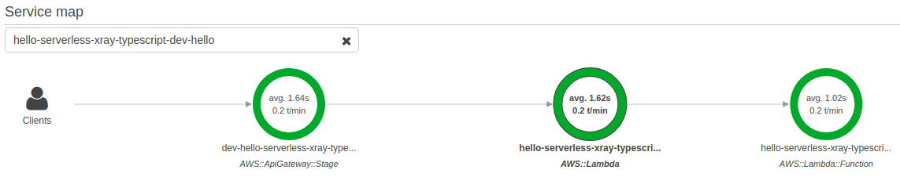
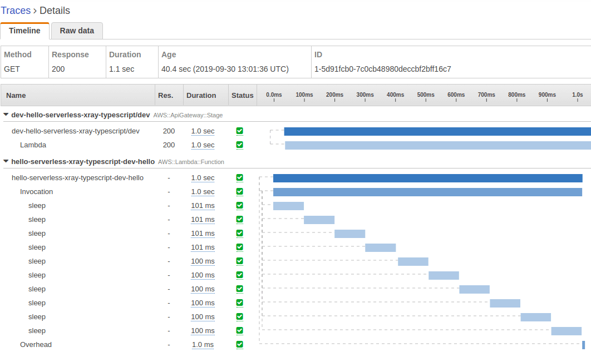

# Hello X-Ray with TypeScript on AWS Serverless

This is a simple tutorial to use AWS X-Ray library on AWS Serverless with TypeScript.

## Walkthrough

### Initiate

```bash
# Install Serverless framework, first.
npm i -g serverless

# Prepare a working directory.
mkdir hello-xray && \
  cd hello-xray

# Create the scaffold using a create command of Serverless cli.
sls create --template aws-nodejs-typescript --name hello-xray
```

Then you can see these files.

```text
+ hello-xray
  - .gitignore
  - handler.tx
  - package.json
  - serverless.yml
  - tsconfig.json
  - webpack.config.js
```

All things are ready to develop. For convinence to use [`git-tutor`](https://github.com/lesnitsky/git-tutor), I'll ignore `yarn.lock` in this repository.

### Renew devDependencies

Dependencies in this template can be outdated so it is better to update after scaffolding.

```bash
yarn add -D @types/aws-lambda @types/node@10 serverless-webpack ts-loader typescript webpack
```

📄 package.json

```diff
      "source-map-support": "^0.5.10"
    },
    "devDependencies": {
-     "@types/aws-lambda": "^8.10.17",
-     "@types/node": "^10.12.18",
-     "serverless-webpack": "^5.2.0",
-     "ts-loader": "^5.3.3",
-     "typescript": "^3.2.4",
-     "webpack": "^4.29.0"
+     "@types/aws-lambda": "^8.10.33",
+     "@types/node": "10",
+     "serverless-webpack": "^5.3.1",
+     "ts-loader": "^6.1.2",
+     "typescript": "^3.6.3",
+     "webpack": "^4.41.0"
    },
    "author": "The serverless webpack authors (https://github.com/elastic-coders/serverless-webpack)",
    "license": "MIT"
- }+ }
```

### Add aws-sdk dependency

[AWS Lambda runtime for node.js 10](https://docs.aws.amazon.com/lambda/latest/dg/lambda-runtimes.html) already includes `aws-sdk@2.488`. So add it into `optionalDependencies`.

📄 package.json

```diff
      "webpack": "^4.41.0"
    },
    "author": "jaeyoung.choi <lactrious@gmail.com>",
-   "license": "MIT"
+   "license": "MIT",
+   "optionalDependencies": {
+     "aws-sdk": "2.488.0"
+   }
  }
```

And ignore `aws-sdk` from Webpack to avoid a huge bundle including all of `aws-sdk` packages.

📄 webpack.config.js

```diff
      filename: "[name].js"
    },
    target: "node",
+   externals: [/aws-sdk/],
    module: {
      rules: [
        // all files with a `.ts` or `.tsx` extension will be handled by `ts-loader`
```

### Add aws-xray-sdk-core

`aws-xray-sdk` includes all of `aws-xray-sdk-*` family such as `express`, `postgres` and `mysql`. If you want to compact one, like me, `aws-xray-sdk-core` is enough.

📄 package.json

```diff
      "build": "sls package"
    },
    "dependencies": {
+     "aws-xray-sdk-core": "^2.3.6",
      "source-map-support": "^0.5.10"
    },
    "devDependencies": {

```

### Add typing for `aws-xray-sdk-core`

There is no official typings for `aws-xray-sdk-core` but [there is almost completed typings on reviewing PR.](https://github.com/aws/aws-xray-sdk-node/blob/481d8456c480cabc371137f78d0b47b623507b2f/packages/core/types/index.d.ts)

Now, just copy it into this source tree, [`typings/aws-xray-sdk-core/index.d.ts`](typings/aws-xray-sdk-core/index.d.ts).

Thanks to [@Kroisse](https://github.com/Kroisse)!

### Write a simple dummy code to capture

We can capture a segment of promise using `captureAsyncFunc`.

📄 handler.ts

```diff
  import { APIGatewayProxyHandler } from "aws-lambda";
  import "source-map-support/register";
+ import { captureAsyncFunc } from "aws-xray-sdk-core";

+ const sleep = (millis: number) =>
+   captureAsyncFunc(
+     "sleep",
+     seg =>
+       new Promise<void>(resolve =>
+         setTimeout(() => {
+           resolve();
+           seg.close();
+         }, millis)
+       )
+   );
+
- export const hello: APIGatewayProxyHandler = async (event, _context) => {
+ export const hello: APIGatewayProxyHandler = async () => {
+   for (let i = 0; i < 10; ++i) {
+     await sleep(100);
+   }
    return {
      statusCode: 200,
      body: "OK"
    };
  };

```

### Install tracing via Serverless framework

[Using Serverless framework,](https://serverless.com/blog/framework-release-v141/) we can use X-Ray Service map very easily because it needs few settings.

📄 serverless.yml

```diff
  provider:
    name: aws
    runtime: nodejs10.x
+   tracing:
+     apiGateway: true
+     lambda: true

  functions:
    hello:

```

### Ignore Webpack warnings

There are two `the request of a dependency is an expression` warnings when we execute `webpack` via `sls package`. It is because they use dynamic `require` in their codes.

1. `call_capture.js` requires the specified attributes to capture in requests of `AWSClient` using `appendAWSWhitelist` function.
2. `colors.js` requires the `color-theme` library in runtime. I think we will not use it because it is required from `winston` that is required from `aws-xray-sdk-core`.

`call_capture.js` requires `aws_whitelist.json` file in its package at runtime so we put it into a bundle. But `Webpack4` can includes these external json file into a bundle automatically without any configurations! And we give a JSON object into `appendAWSWhitelist` istead of a path to `require` to avoid `require` in runtime that breaks `Webpack`. So we can ignore the first issue.
And, we will not change `color-theme` of `winston` in runtime. Let's ignore the second issue, too.

Now, we can ignore these warnings by simple regular expressions.

📄 webpack.config.js

```diff
  const path = require("path");
  const slsw = require("serverless-webpack");

+ const ignoreWarnings = [
+   [/call_capturer.js/, /the request of a dependency is an expression/],
+   [/colors.js/, /the request of a dependency is an expression/]
+ ];
+
  module.exports = {
    mode: slsw.lib.webpack.isLocal ? "development" : "production",
    entry: slsw.lib.entries,

    externals: [/aws-sdk/],
    module: {
      rules: [{ test: /\.tsx?$/, loader: "ts-loader" }]
+   },
+   stats: {
+     warningsFilter: warning => {
+       return ignoreWarnings.some(regexs =>
+         regexs.every(regex => regex.test(warning))
+       );
+     }
    }
  };
```

### Deploy and check it

Now, deploy it!

```bash
sls deploy
```

At last, we get the endpoint of this `hello` API.

```text
api keys:
  None
endpoints:
  GET - https://0000000000.execute-api.xx-xxxxxx-x.amazonaws.com/dev/hello
functions:
  hello: hello-serverless-xray-typescript-dev-hello
layers:
  None
```

Request it using `curl`. After that, we can see our captured segments in AWS X-Ray console.

```bash
curl "https://0000000000.execute-api.xx-xxxxxx-x.amazonaws.com/dev/hello"
```

- Service map
  
- Trace details
  
